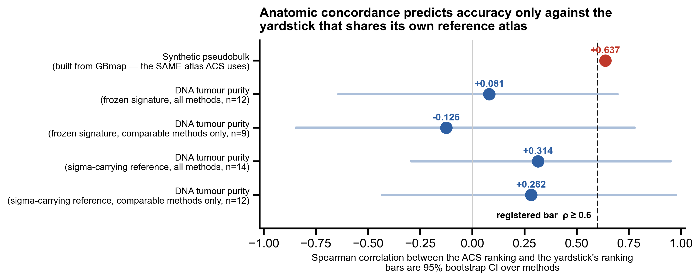
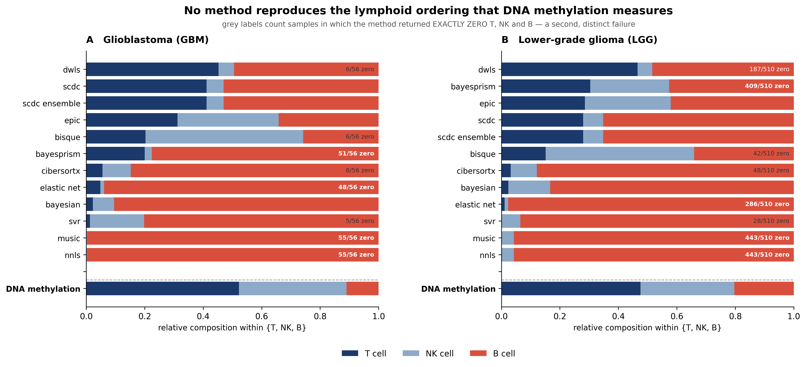
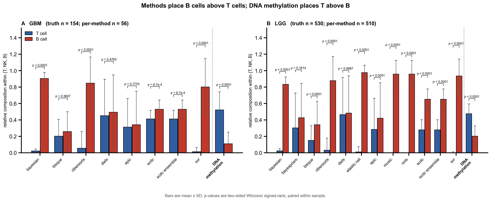
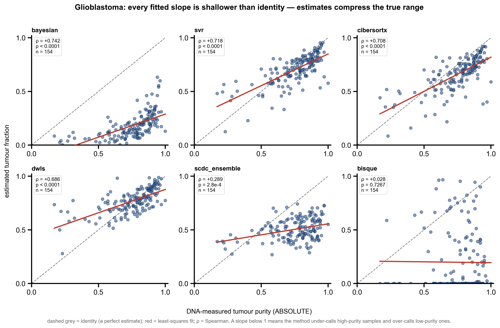
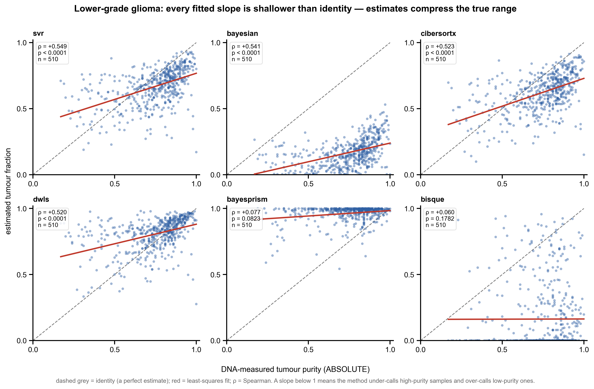
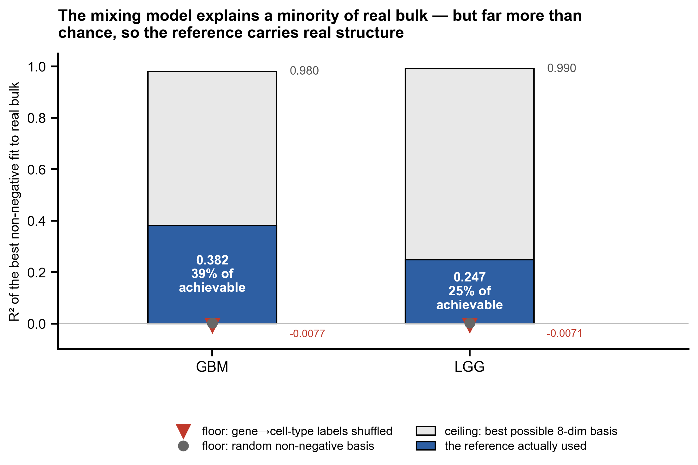
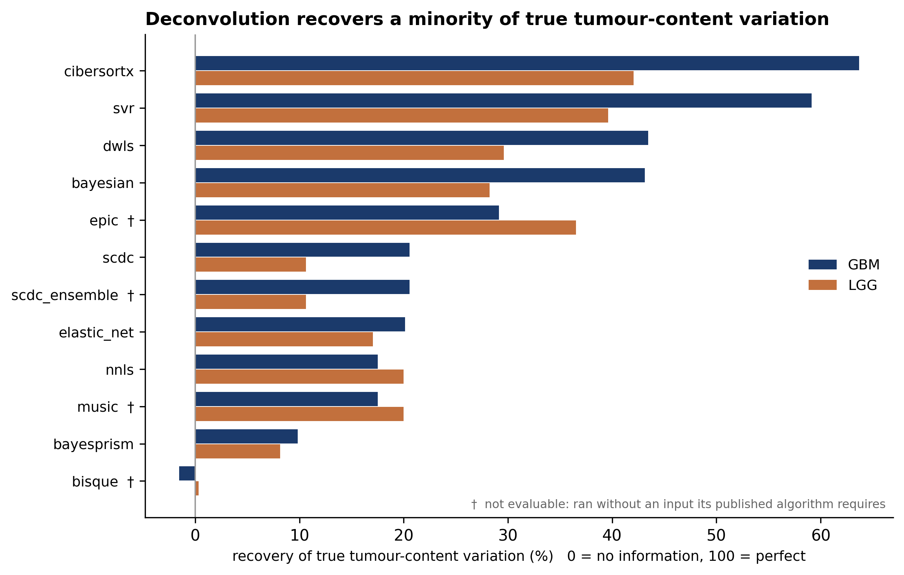

# Figures

*Generated by `scripts/build_figure_index.py`. Figures themselves come from `scripts/build_paper_figures.py` and `scripts/build_stats_figures.py`; every value plotted is read from an artefact under `results/`. Captions are written for a reader who skips the body: what was measured, on how many samples, by what test.*

*Each figure is available as PNG (300 dpi, for drafts and review) and PDF (vector, for submission) in `docs/figures/`.*

---

## Figure 1. Anatomic concordance predicts accuracy only against the yardstick that shares its own reference atlas.

**Figure 1.** *Anatomic concordance predicts accuracy only against the yardstick that shares its own reference atlas.* Spearman correlation between the ranking produced by the Anatomic Concordance Score (ACS) and the ranking produced by each external yardstick. Points are the correlation; bars are 95% bootstrap confidence intervals over methods. The dashed line is the pre-registered bar (ρ ≥ 0.60), fixed before any result was computed. Only the synthetic pseudobulk yardstick clears it (ρ = 0.6372), and that yardstick is built from GBmap — the same single-cell atlas the ACS arm deconvolves against. Against DNA-measured tumour purity, which shares nothing with ACS, the correlation is 0.081 (n = 12 methods) and -0.1255 restricted to comparable methods. Scoring both arms on the same reference build removes the one remaining objection and changes nothing: 0.3142 (n = 14) and 0.2817 (n = 12).

`docs/figures/Figure_detects_not_ranks.png` · `docs/figures/Figure_detects_not_ranks.pdf`

## Figure 2. No method reproduces the lymphoid ordering that DNA methylation measures, in either tumour type.

**Figure 2.** *No method reproduces the lymphoid ordering that DNA methylation measures, in either tumour type.* Relative composition within {T, NK, B} for every deconvolution method, against DNA methylation as an independent per-cell-type ground truth (EpiDISH RPC on the `centDHSbloodDMC.m` reference). Both sides are renormalised within the same three cell types, so the leukocyte-subcomposition and all-cell-fraction denominators cancel by construction. (A) Glioblastoma, truth n = 155. (B) Lower-grade glioma, truth n = 530. Methylation orders the compartment T>NK>B; 0 of 12 methods in GBM and 0 of 12 in LGG agree that T exceeds B. Grey labels count samples in which the method returned EXACTLY ZERO T, NK and B — a second and distinct failure, affecting 4 of 12 methods in GBM and 4 of 12 in LGG.

`docs/figures/Figure_lymphoid_failure.png` · `docs/figures/Figure_lymphoid_failure.pdf`

## Figure 3. Methods place B cells above T cells; DNA methylation places T above B.

**Figure 3.** *Methods place B cells above T cells; DNA methylation places T above B.* Mean ± SD of the T-cell and B-cell fraction within {T, NK, B}, per method and for the methylation truth bar. p-values are two-sided Wilcoxon signed-rank tests paired within sample, not comparisons of two cohort averages. Sample counts differ within a panel and the difference is not incidental: 155 GBM samples have methylation data, 154 of those admit an ordering at all (the remaining 1 returned exactly zero T, NK and B, so no ordering is defined), and only 56 also have a deconvolution estimate — most TCGA-GBM methylation was assayed on the older HM27 platform rather than HM450.

`docs/figures/Figure_lymphoid_paired.png` · `docs/figures/Figure_lymphoid_paired.pdf`

## Figure 4. Glioblastoma: every fitted slope is shallower than identity, so estimates compress the true range.

**Figure 4.** *Glioblastoma: every fitted slope is shallower than identity, so estimates compress the true range.* Estimated tumour fraction against DNA-measured tumour purity (ABSOLUTE, from copy number), one panel per method, ordered by Spearman ρ. Each panel gives ρ, its p-value and n. The dashed grey line is identity — where a perfect estimate would lie; the red line is the least-squares fit. A slope below 1 means the method under-calls high-purity samples and over-calls low-purity ones. Note that a high correlation does not imply a usable estimate: `bayesian` reaches ρ = +0.742 with its entire distribution far below identity.

`docs/figures/Figure_purity_scatter_gbm.png` · `docs/figures/Figure_purity_scatter_gbm.pdf`

## Figure 5. Lower-grade glioma: the same compression, on 510 samples.

**Figure 5.** *Lower-grade glioma: the same compression, on 510 samples.* As the preceding figure, for the TCGA lower-grade glioma cohort. Across both cohorts all 24 method-by-cohort fitted slopes lie below 1 (GBM maximum 0.637, LGG maximum 0.421).

`docs/figures/Figure_purity_scatter_lgg.png` · `docs/figures/Figure_purity_scatter_lgg.pdf`

## Figure 6. The additive mixing model explains a minority of real bulk — but far more than chance.

**Figure 6.** *The additive mixing model explains a minority of real bulk — but far more than chance.* R² of the best non-negative fit of the reference profiles to each bulk sample, median across samples, on the marker gene space. The model leaves 63.79% (GBM) and 76.4% (LGG) of variance unexplained. Two floors and a ceiling make that number interpretable: shuffling which gene belongs to which cell type drops R² to -0.0077, and a random non-negative basis to 0.0016, so the reference carries real structure; the top-8 SVD of the bulk itself reaches 0.9803, which is the best any eight-dimensional basis could achieve on the same samples. The reference attains 39% (GBM) and 25% (LGG) of that ceiling.

`docs/figures/Figure_model_fit_bound.png` · `docs/figures/Figure_model_fit_bound.pdf`

## Figure 7. Deconvolution recovers a minority of true tumour-content variation.

**Figure 7.** *Deconvolution recovers a minority of true tumour-content variation.* Recovery of true tumour-content variation per method, against DNA-measured purity, in both cohorts. Recovery is defined as 1 + the slope of (estimate − truth) regressed on truth: 0 indicates no information and 100% a perfect estimate. The statistic is invariant to a constant offset, so it measures tracking rather than calibration. Methods marked † ran without an input their published algorithm requires and are reported as not evaluable rather than omitted or scored.

`docs/figures/Figure_tumour_recovery.png` · `docs/figures/Figure_tumour_recovery.pdf`

