# Figures

*Generated by `scripts/build_figure_index.py`. Figures themselves come from `scripts/build_paper_figures.py` and `scripts/build_stats_figures.py`; every value plotted is read from an artefact under `results/`. Captions are written for a reader who skips the body: what was measured, on how many samples, by what test.*

*Each figure is available as PNG (300 dpi, for drafts and review) and PDF (vector, for submission) in `docs/figures/`.*

---

## Figure 1. Anatomic concordance predicts accuracy only against the yardstick that shares its own reference atlas.

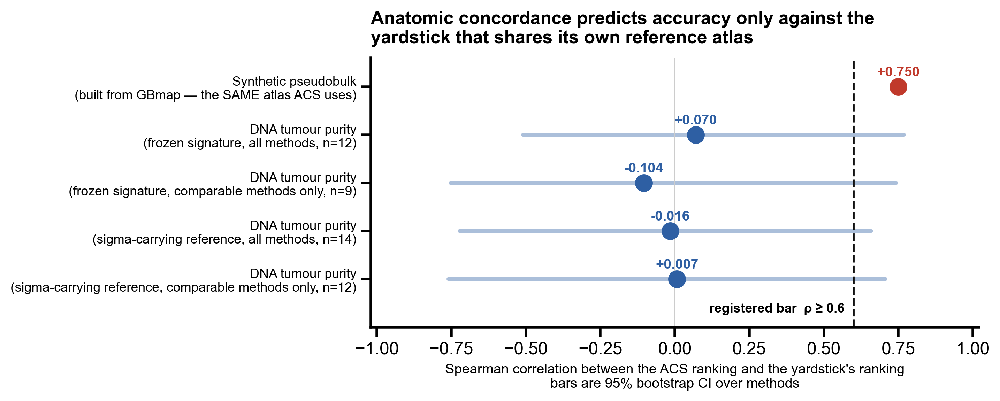

**Figure 1.** *Anatomic concordance predicts accuracy only against the yardstick that shares its own reference atlas.* Spearman correlation between the ranking produced by the Anatomic Concordance Score (ACS) and the ranking produced by each external yardstick. Points are the correlation; bars are 95% bootstrap confidence intervals over methods. The dashed line is the pre-registered bar (ρ ≥ 0.60), fixed before any result was computed. Only the synthetic pseudobulk yardstick clears it (ρ = 0.6372), and that yardstick is built from GBmap — the same single-cell atlas the ACS arm deconvolves against. Against DNA-measured tumour purity, which shares nothing with ACS, the correlation is 0.081 (n = 12 methods) and -0.1255 restricted to comparable methods. Scoring both arms on the same reference build removes the one remaining objection and changes nothing: 0.3142 (n = 14) and 0.2817 (n = 12).

`docs/figures/Figure_detects_not_ranks.png` · `docs/figures/Figure_detects_not_ranks.pdf`

**Provenance:** drawn by `scripts/build_paper_figures.py::fig_detects_not_ranks` (Python 3.14.5, matplotlib 3.10.9), rendered 2026-10-07, from the artefacts under `results/`. The plotting code was generated with Claude Code (Anthropic); see `~/STS_AI_LOG/AI_CONTRIBUTION_INVENTORY.md`.

## Figure 2. No method reproduces the lymphoid ordering that DNA methylation measures, in either tumour type.

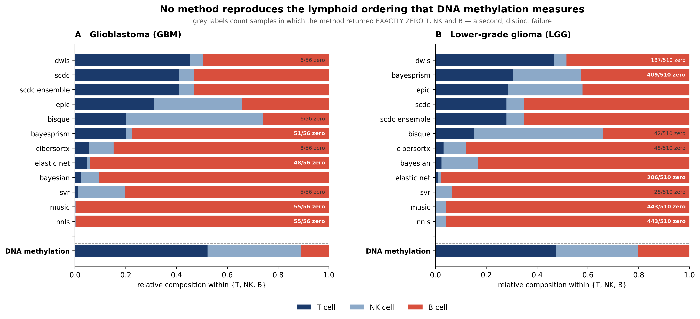

**Figure 2.** *No method reproduces the lymphoid ordering that DNA methylation measures, in either tumour type.* Relative composition within {T, NK, B} for every deconvolution method, against DNA methylation as an independent per-cell-type ground truth (EpiDISH RPC on the `centDHSbloodDMC.m` reference). Both sides are renormalised within the same three cell types, so the leukocyte-subcomposition and all-cell-fraction denominators cancel by construction. (A) Glioblastoma, truth n = 155. (B) Lower-grade glioma, truth n = 530. Methylation orders the compartment T>NK>B; 0 of 12 methods in GBM and 0 of 12 in LGG agree that T exceeds B. Grey labels count samples in which the method returned EXACTLY ZERO T, NK and B — a second and distinct failure, affecting 4 of 12 methods in GBM and 4 of 12 in LGG.

`docs/figures/Figure_lymphoid_failure.png` · `docs/figures/Figure_lymphoid_failure.pdf`

**Provenance:** drawn by `scripts/build_paper_figures.py::fig_lymphoid` (Python 3.14.5, matplotlib 3.10.9), rendered 2026-10-07, from the artefacts under `results/`. The plotting code was generated with Claude Code (Anthropic); see `~/STS_AI_LOG/AI_CONTRIBUTION_INVENTORY.md`.

## Figure 3. Methods place B cells above T cells; DNA methylation places T above B.

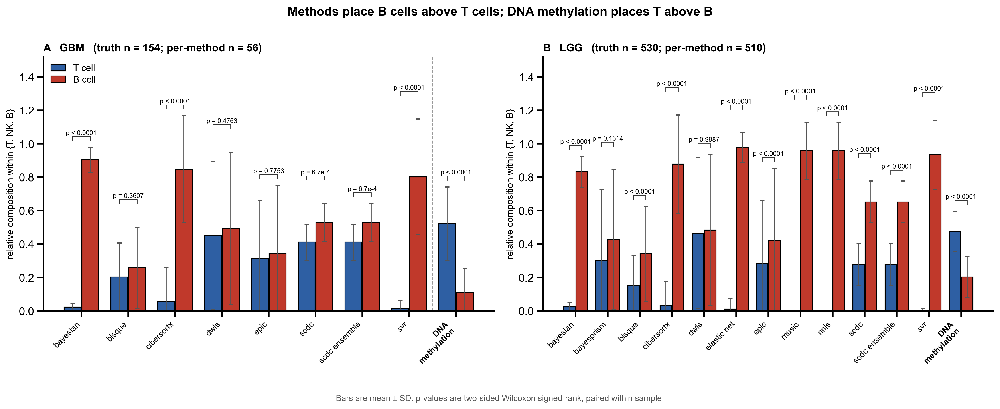

**Figure 3.** *Methods place B cells above T cells; DNA methylation places T above B.* Mean ± SD of the T-cell and B-cell fraction within {T, NK, B}, per method and for the methylation truth bar. p-values are two-sided Wilcoxon signed-rank tests paired within sample, not comparisons of two cohort averages. Sample counts differ within a panel and the difference is not incidental: 155 GBM samples have methylation data, 154 of those admit an ordering at all (the remaining 1 returned exactly zero T, NK and B, so no ordering is defined), and only 56 also have a deconvolution estimate — most TCGA-GBM methylation was assayed on the older HM27 platform rather than HM450.

`docs/figures/Figure_lymphoid_paired.png` · `docs/figures/Figure_lymphoid_paired.pdf`

**Provenance:** drawn by `scripts/build_stats_figures.py::fig_paired_lymphoid` (Python 3.14.5, matplotlib 3.10.9), rendered 2026-10-07, from the artefacts under `results/`. The plotting code was generated with Claude Code (Anthropic); see `~/STS_AI_LOG/AI_CONTRIBUTION_INVENTORY.md`.

## Figure 4. Glioblastoma: every fitted slope is shallower than identity, so estimates compress the true range.

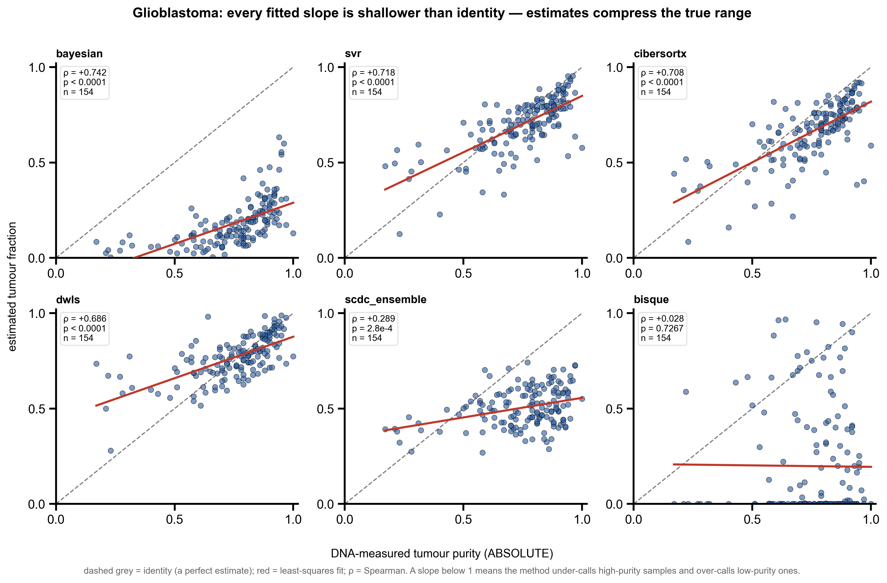

**Figure 4.** *Glioblastoma: every fitted slope is shallower than identity, so estimates compress the true range.* Estimated tumour fraction against DNA-measured tumour purity (ABSOLUTE, from copy number), one panel per method, ordered by Spearman ρ. Each panel gives ρ, its p-value and n. The dashed grey line is identity — where a perfect estimate would lie; the red line is the least-squares fit. A slope below 1 means the method under-calls high-purity samples and over-calls low-purity ones. Note that a high correlation does not imply a usable estimate: `bayesian` reaches ρ = +0.742 with its entire distribution far below identity.

`docs/figures/Figure_purity_scatter_gbm.png` · `docs/figures/Figure_purity_scatter_gbm.pdf`

**Provenance:** drawn by `scripts/build_stats_figures.py::fig_purity_scatter` (Python 3.14.5, matplotlib 3.10.9), rendered 2026-10-07, from the artefacts under `results/`. The plotting code was generated with Claude Code (Anthropic); see `~/STS_AI_LOG/AI_CONTRIBUTION_INVENTORY.md`.

## Figure 5. Lower-grade glioma: the same compression, on 510 samples.

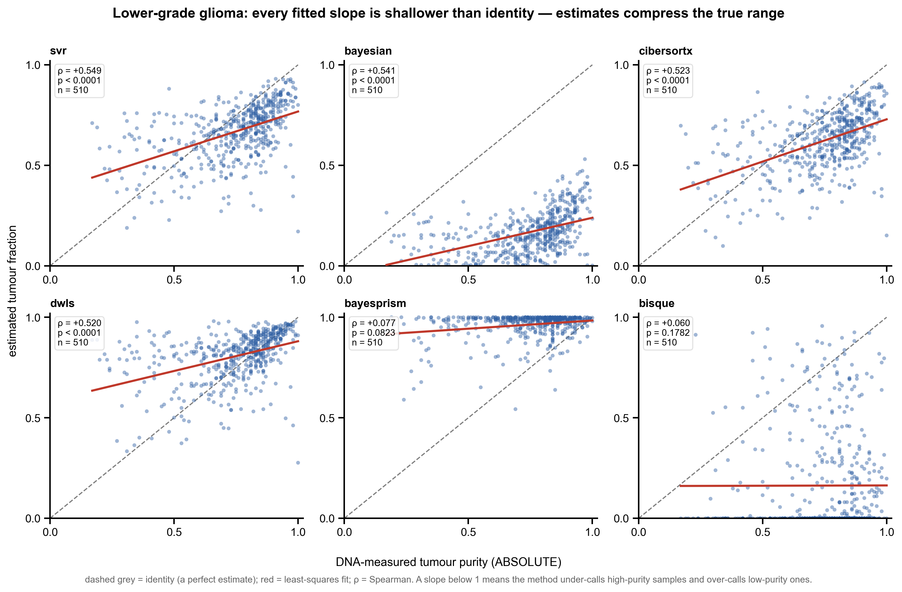

**Figure 5.** *Lower-grade glioma: the same compression, on 510 samples.* As the preceding figure, for the TCGA lower-grade glioma cohort. Across both cohorts all 24 method-by-cohort fitted slopes lie below 1 (GBM maximum 0.637, LGG maximum 0.421).

`docs/figures/Figure_purity_scatter_lgg.png` · `docs/figures/Figure_purity_scatter_lgg.pdf`

**Provenance:** drawn by `scripts/build_stats_figures.py::fig_purity_scatter` (Python 3.14.5, matplotlib 3.10.9), rendered 2026-10-07, from the artefacts under `results/`. The plotting code was generated with Claude Code (Anthropic); see `~/STS_AI_LOG/AI_CONTRIBUTION_INVENTORY.md`.

## Figure 6. The additive mixing model explains a minority of real bulk — but far more than chance.

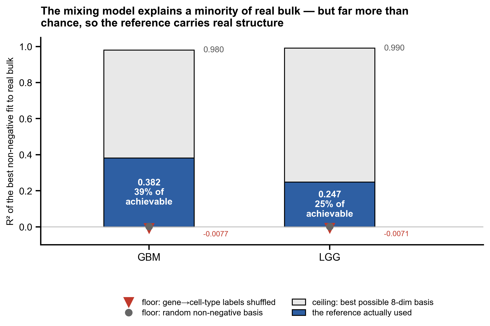

**Figure 6.** *The additive mixing model explains a minority of real bulk — but far more than chance.* R² of the best non-negative fit of the reference profiles to each bulk sample, median across samples, on the marker gene space. The model leaves 63.79% (GBM) and 76.4% (LGG) of variance unexplained. Two floors and a ceiling make that number interpretable: shuffling which gene belongs to which cell type drops R² to -0.0077, and a random non-negative basis to 0.0016, so the reference carries real structure; the top-8 SVD of the bulk itself reaches 0.9803, which is the best any eight-dimensional basis could achieve on the same samples. The reference attains 39% (GBM) and 25% (LGG) of that ceiling.

`docs/figures/Figure_model_fit_bound.png` · `docs/figures/Figure_model_fit_bound.pdf`

**Provenance:** drawn by `scripts/build_paper_figures.py::fig_model_fit` (Python 3.14.5, matplotlib 3.10.9), rendered 2026-10-07, from the artefacts under `results/`. The plotting code was generated with Claude Code (Anthropic); see `~/STS_AI_LOG/AI_CONTRIBUTION_INVENTORY.md`.

## Figure 7. Deconvolution recovers a minority of true tumour-content variation.

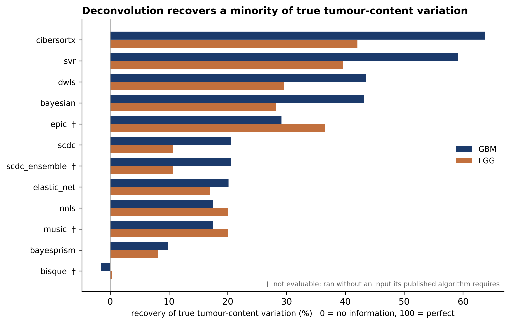

**Figure 7.** *Deconvolution recovers a minority of true tumour-content variation.* Recovery of true tumour-content variation per method, against DNA-measured purity, in both cohorts. Recovery is defined as 1 + the slope of (estimate − truth) regressed on truth: 0 indicates no information and 100% a perfect estimate. The statistic is invariant to a constant offset, so it measures tracking rather than calibration. Methods marked † ran without an input their published algorithm requires and are reported as not evaluable rather than omitted or scored.

`docs/figures/Figure_tumour_recovery.png` · `docs/figures/Figure_tumour_recovery.pdf`

**Provenance:** drawn by `scripts/build_paper_figures.py::fig_recovery` (Python 3.14.5, matplotlib 3.10.9), rendered 2026-10-07, from the artefacts under `results/`. The plotting code was generated with Claude Code (Anthropic); see `~/STS_AI_LOG/AI_CONTRIBUTION_INVENTORY.md`.

## Figure 8. Bisque's cohort-mean composition is its single-cell reference's composition.

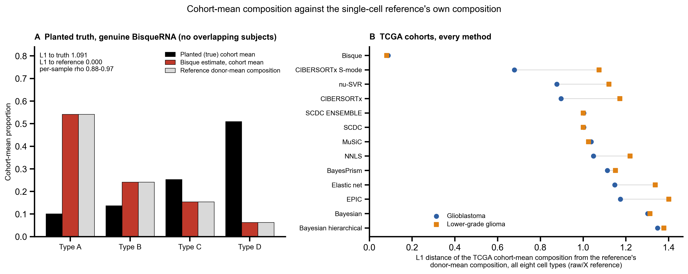

**Figure 8.** *Bisque's cohort-mean composition is its single-cell reference's composition.* (A) Genuine BisqueRNA run without overlapping subjects -- the only mode a TCGA cohort permits -- on synthetic data whose true cohort mean is set far from the reference's. The estimated cohort mean lies 0 (L1) from the reference's donor-mean composition and 1.0915 from the truth, while samples are still ranked correctly (per-sample Spearman 0.88-0.97); a matched control in which truth equals the reference is recovered. This is the package's declared assumption (Jew et al. 2020, Methods). (B) For every method, the L1 distance of its TCGA cohort-mean composition, over all eight cell types, from the same reference's donor-mean composition (raw/X reference; glioblastoma n = 154, lower-grade glioma n = 510). Bisque lies 0.0874 and 0.0807 from it; every other method lies 0.68 or more.

`docs/figures/Figure_bisque_anchoring.png` · `docs/figures/Figure_bisque_anchoring.pdf`

**Provenance:** drawn by `scripts/build_paper_figures.py::fig_bisque_anchoring` (Python 3.14.5, matplotlib 3.10.9), rendered 2026-10-07, from the artefacts under `results/`. The plotting code was generated with Claude Code (Anthropic); see `~/STS_AI_LOG/AI_CONTRIBUTION_INVENTORY.md`.

## Figure 9. ACS and an AUC measure the same thing on different scales, and neither tracks accuracy.

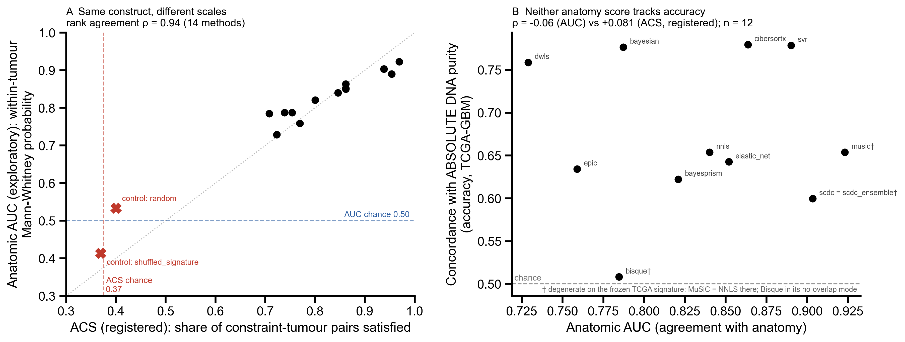

**Figure 9.** *ACS and an AUC measure the same thing on different scales, and neither tracks accuracy.* (A) The registered Anatomic Concordance Score (ACS: each constraint-tumour pair scores 1 or 0 on per-structure means) against its graded counterpart, the within-tumour Mann-Whitney AUC over the same pairs, samples and permutation null (exploratory). They rank the 14 comparable methods almost identically (Spearman ρ = 0.94) but sit on different scales: dashed lines mark each statistic's chance level (median permutation-null mean), and the AUC gives partial credit on the two conjunction constraints (C4, C7) where ACS gives none. Crosses are the two broken-input controls (AUC permutation p = 0.20, 0.99). (B) The AUC against accuracy -- Harrell's concordance of each method's TCGA-GBM tumour fraction with ABSOLUTE DNA purity (n = 154 samples). Substituted for ACS in the registered agreement test it gives ρ = -0.06 (p = 0.85, n = 12 methods), against ρ = +0.081 for the registered ACS: the null result is not an artefact of thresholding. Identical points are labelled together, and † marks a method that is degenerate on the frozen TCGA signature (MuSiC without cross-donor variance is NNLS; Bisque runs its no-overlap mode; SCDC ENSEMBLE with one reference is SCDC), so its concordance there is not its own.

`docs/figures/Figure_acs_vs_auc.png` · `docs/figures/Figure_acs_vs_auc.pdf`

**Provenance:** drawn by `scripts/build_paper_figures.py::fig_acs_vs_auc` (Python 3.14.5, matplotlib 3.10.9), rendered 2026-10-07, from the artefacts under `results/`. The plotting code was generated with Claude Code (Anthropic); see `~/STS_AI_LOG/AI_CONTRIBUTION_INVENTORY.md`.

## Figure 10. Reference-side tests of the lymphoid inversion: none removes it.

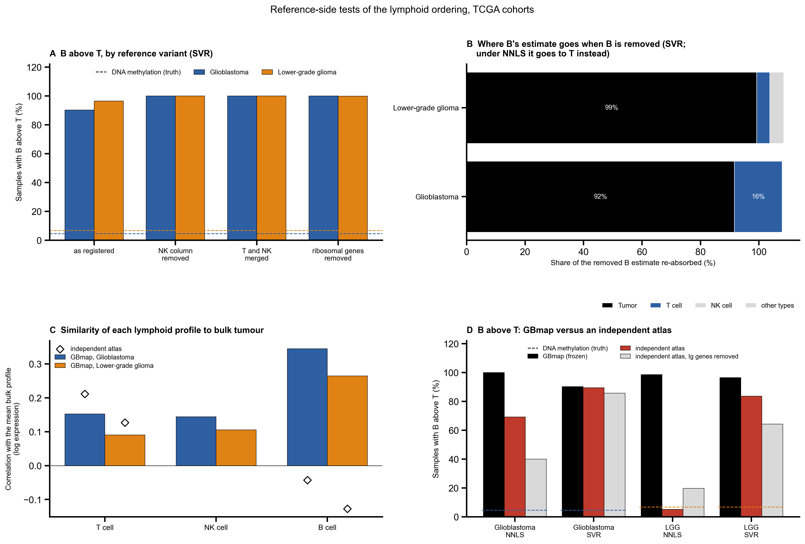

**Figure 10.** *Reference-side tests of the lymphoid inversion: none removes it.* TCGA cohorts. (A) Share of samples with B above T under SVR for each reference variant -- as registered (glioblastoma 90%, lower-grade glioma 96%), with the NK column removed, with T and NK merged, and with ribosomal genes removed (100% and 100%). Every variant keeps B above T in nearly all samples; dashed lines mark the share DNA methylation implies. (B) Where the B column's estimate goes when the column is removed, under SVR: 92% (glioblastoma) and 99% (lower-grade glioma) is re-absorbed by Tumor. Under NNLS it goes to T instead (182% and 109%): the re-absorption is estimator-specific. (C) Correlation of each lymphoid profile with the mean bulk profile (log expression). GBmap's B profile is the most bulk-like (r = 0.34 in glioblastoma); the independent atlas's B profile is anti-correlated. (D) B above T under GBmap (frozen signature), under an independent atlas (Abdelfattah et al. 2022, GSE182109; not a GBmap source study), and under that atlas with immunoglobulin genes removed, for NNLS and SVR in both cohorts. The independent atlas recovers T above B only for NNLS in lower-grade glioma; immunoglobulin removal changes resolution, not direction.

`docs/figures/Figure_lymphoid_mechanisms.png` · `docs/figures/Figure_lymphoid_mechanisms.pdf`

**Provenance:** drawn by `scripts/build_paper_figures.py::fig_lymphoid_mechanisms` (Python 3.14.5, matplotlib 3.10.9), rendered 2026-10-07, from the artefacts under `results/`. The plotting code was generated with Claude Code (Anthropic); see `~/STS_AI_LOG/AI_CONTRIBUTION_INVENTORY.md`.

## Figure 11. Truth-free stability against agreement with DNA truth (exploratory).

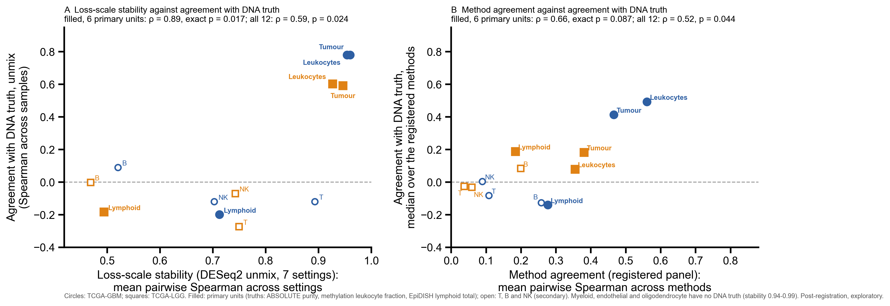

**Figure 11.** *Truth-free stability against agreement with DNA truth (exploratory).* Post-registration (Extension E2; rules in `prespecified/identifiability_diagnostics.md`, fixed before computing). Each point is one compartment in one TCGA cohort (circles glioblastoma, squares lower-grade glioma). Filled points are the primary units, with truths from DNA: ABSOLUTE purity for tumour content (n = 154 and 510), the methylation leukocyte fraction for all leukocytes (n = 129 and 510), and EpiDISH for the lymphoid total (n = 56 and 510). Open points are T, B and NK (secondary). (A) Stability of DESeq2 `unmix`'s per-sample estimates across seven settings of its loss scale (mean pairwise Spearman) against `unmix`'s agreement with the truth: rho = 0.89 across the six primary units (exact one-sided p = 0.017). In glioblastoma, two settings coincide, because the pre-declared shift is 1. Over distinct fits the result is unchanged (rho = 0.89). (B) Agreement among the registered methods against their median agreement with the truth: rho = 0.66 (p = 0.087). Tumour and leukocyte content are stable and accurate; the lymphoid total is the least stable and does not track methylation. Stability is not sufficient: T cells in glioblastoma are stable and do not track methylation. EpiDISH's blood reference measures shares of the immune compartment; with each estimate's lymphoid share of its own leukocytes in place of its tissue fraction, the association strengthens (rho = 0.94) and the lymphoid estimate still does not track methylation.

`docs/figures/Figure_identifiability.png` · `docs/figures/Figure_identifiability.pdf`

**Provenance:** drawn by `scripts/build_paper_figures.py::fig_identifiability` (Python 3.14.5, matplotlib 3.10.9), rendered 2026-10-07, from the artefacts under `results/`. The plotting code was generated with Claude Code (Anthropic); see `~/STS_AI_LOG/AI_CONTRIBUTION_INVENTORY.md`.

## Figure 12. The lymphoid truth by every instrument that measures it, beside the methods.

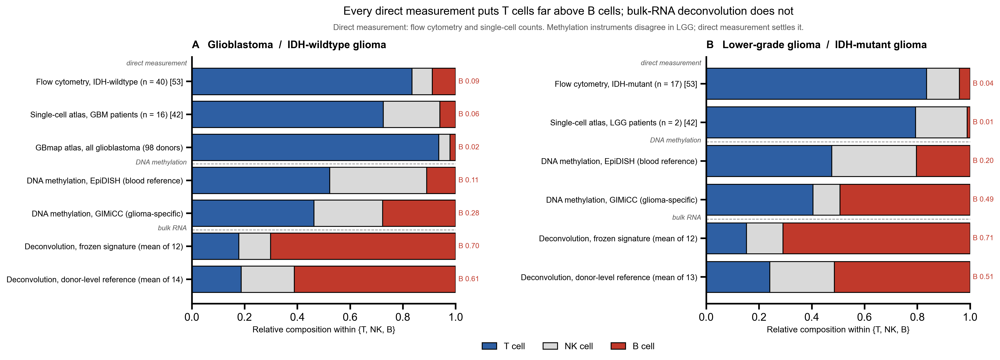

**Figure 12.** *The lymphoid truth by every instrument that measures it, beside the methods.* Relative composition within {T, NK, B}; the B share of lymphocytes is printed beside each bar. **Direct measurement:** flow cytometry of 17 IDH-mutant and 40 IDH-wildtype gliomas (Klemm et al. [53], Figure 1F, measured from the figure's vector geometry and validated against two numbers the paper prints: 33.01 vs 33.01 and 46.23 vs 46.23; `prespecified/klemm_t_vs_b.md`); an independent single-cell atlas (Abdelfattah et al. [42], 18 patients, T and NK separated per cell by a rule declared beforehand; `prespecified/atlas_t_vs_b.md`); GBmap's core atlas (98 glioblastoma donors with lymphocytes). **DNA methylation:** EpiDISH (blood reference; the registered truth) and GIMiCC (glioma-specific; registered reading INCONCLUSIVE). **Bulk-RNA deconvolution:** the mean composition over the registered methods, frozen signature and donor-level reference. Every direct measurement puts T far above B (IDH-mutant flow cytometry 21:1); the methods place B above T.

`docs/figures/Figure_truth_instruments.png` · `docs/figures/Figure_truth_instruments.pdf`

**Provenance:** drawn by `scripts/build_paper_figures.py::fig_truth_instruments` (Python 3.14.5, matplotlib 3.10.9), rendered 2026-10-07, from the artefacts under `results/`. The plotting code was generated with Claude Code (Anthropic); see `~/STS_AI_LOG/AI_CONTRIBUTION_INVENTORY.md`.

## Figure 13. Factors that decide whether deconvolution can be trusted, against real DNA truths.

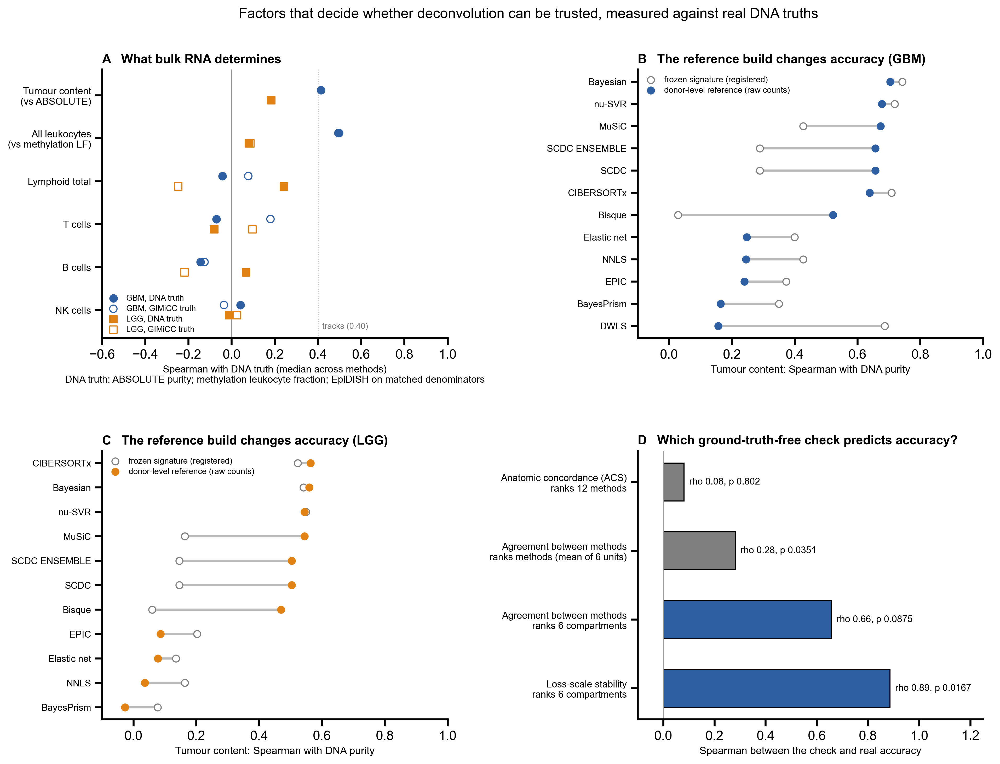

**Figure 13.** *Factors that decide whether deconvolution can be trusted, against real DNA truths.* **(A)** Accuracy by compartment: Spearman between each method's estimate and the DNA truth, median across the registered methods (filled: ABSOLUTE purity, the methylation leukocyte fraction, EpiDISH on matched denominators; open: GIMiCC tissue fractions). Tumour and total-leukocyte content track their truths in glioblastoma; lymphoid subtypes do not, against either methylation instrument. **(B, C)** Tumour-content accuracy of each method under the registered frozen signature (open) and a donor-level reference built from raw counts (filled): the reference build moves a method's accuracy by up to 0.5 in either direction. **(D)** How well a ground-truth-free check predicts real accuracy: anatomic concordance ranks 12 methods at rho = 0.08 (p = 0.80); agreement between methods ranks methods at a mean rho = 0.28 and compartments at 0.66; loss-scale stability ranks compartments at rho = 0.89 (exact p = 0.017). Interpretation and practical guidance: `docs/ACCURACY_FACTORS.md`.

`docs/figures/Figure_accuracy_factors.png` · `docs/figures/Figure_accuracy_factors.pdf`

**Provenance:** drawn by `scripts/build_paper_figures.py::fig_accuracy_factors` (Python 3.14.5, matplotlib 3.10.9), rendered 2026-10-07, from the artefacts under `results/`. The plotting code was generated with Claude Code (Anthropic); see `~/STS_AI_LOG/AI_CONTRIBUTION_INVENTORY.md`.

## Figure 14. An independent cohort with a per-sample DNA truth: CPTAC glioblastoma against whole-genome purity.

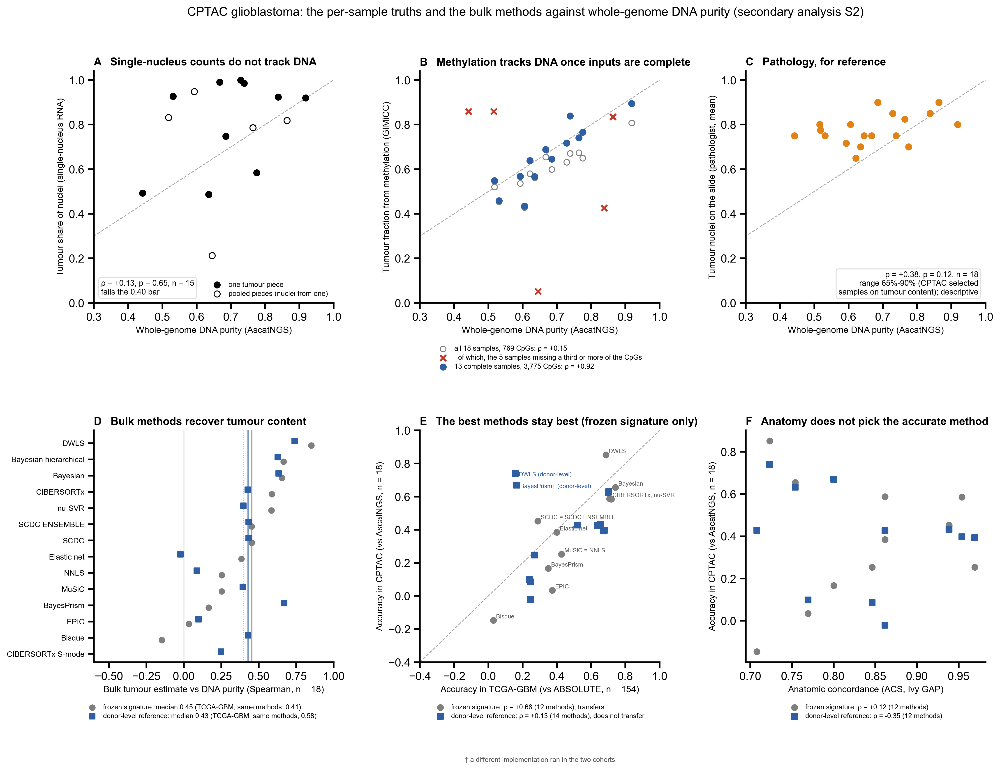

**Figure 14.** *An independent cohort with a per-sample DNA truth: CPTAC glioblastoma against whole-genome purity.* Secondary analysis, registered after the primary CPTAC control failed and before any value shown here was seen (`prespecified/cptac_wgs_purity_secondary.md`). Truth: AscatNGS tumour purity from whole-genome sequencing (GDC), 18 tumours, range 0.44-0.92. **(A)** Tumour share of single nuclei (GDC clusters, named by the registered marker rule) against DNA purity: rho = 0.13 (permutation p = 0.65, n = 15); it fails the registered 0.40 bar, so every per-sample reading made against the nuclei stays INCONCLUSIVE. Open symbols, tumours whose bulk and DNA aliquots pooled several pieces while the nuclei came from one. **(B)** Methylation purity (GIMiCC) against DNA purity: on the CpGs complete in all 18 samples (769 of 4,022), rho = 0.15; red crosses, the five samples missing a third or more of the library; on the 13 complete samples (3,775 CpGs), rho = 0.92 (OPEN_DEFECTS D30). **(C)** Pathologist's percent tumour nuclei, descriptive: range 65%-90%, rho = 0.38. **(D)** Each bulk method's tumour estimate against DNA purity (n = 18); vertical lines, the medians (0.45 frozen signature, 0.43 donor-level reference; TCGA-GBM on the same methods 0.41 and 0.58); dotted, the 0.40 bar. **(E)** Each method's accuracy in CPTAC against its accuracy in TCGA-GBM (ABSOLUTE, n = 154): the ranking transfers on the frozen signature (rho = 0.68, 12 methods) but not on the donor-level reference (rho = 0.13); a dagger marks BayesPrism, which ran as the R package in CPTAC and as the Python reimplementation in TCGA. Methods that are degenerate copies of another share a point ("MuSiC = NNLS"). **(F)** Anatomic concordance against accuracy in CPTAC: rho = 0.12 (frozen) and -0.35 (donor-level); the registered bar is 0.60.

`docs/figures/Figure_cptac_wgs.png` · `docs/figures/Figure_cptac_wgs.pdf`

**Provenance:** drawn by `scripts/build_paper_figures.py::fig_cptac_wgs` (Python 3.14.5, matplotlib 3.10.9), rendered 2026-10-07, from the artefacts under `results/`. The plotting code was generated with Claude Code (Anthropic); see `~/STS_AI_LOG/AI_CONTRIBUTION_INVENTORY.md`.

## Figure 15. Study design: anatomy as a registered test, then every method against truths that share nothing with it.

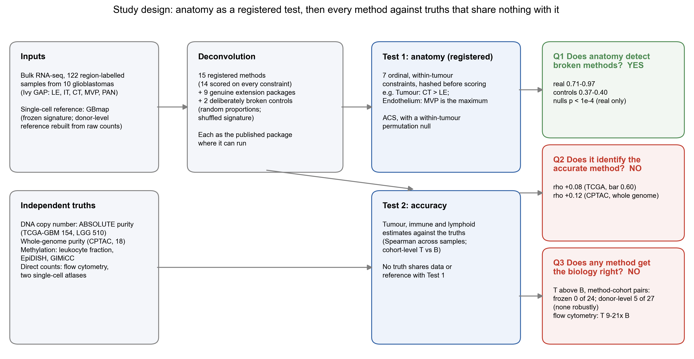

**Figure 15.** *Study design: anatomy as a registered test, then every method against truths that share nothing with it.* Bulk RNA from 122 histology-labelled Ivy GAP samples (10 glioblastomas) is deconvolved by the registered methods, the genuine extension packages and two deliberately broken controls. Test 1 scores each method against seven ordinal, within-tumour anatomic constraints, hashed and registered before scoring, with a within-tumour permutation null (ACS). Test 2 scores the same methods against truths that share no data or reference with Test 1: DNA copy number (ABSOLUTE; CPTAC whole-genome purity), DNA methylation (leukocyte fraction, EpiDISH, GIMiCC) and direct counts (flow cytometry, two single-cell atlases). The three answer boxes carry the registered results, read from artefacts; Q3 gives both reference builds, as OPEN_DEFECTS D23 requires.

`docs/figures/Figure_design.png` · `docs/figures/Figure_design.pdf`

**Provenance:** drawn by `scripts/build_paper_figures.py::fig_design` (Python 3.14.5, matplotlib 3.10.9), rendered 2026-10-07, from the artefacts under `results/`. The plotting code was generated with Claude Code (Anthropic); see `~/STS_AI_LOG/AI_CONTRIBUTION_INVENTORY.md`.

## Figure 16. What the anatomic score separates: each registered constraint, method by method.

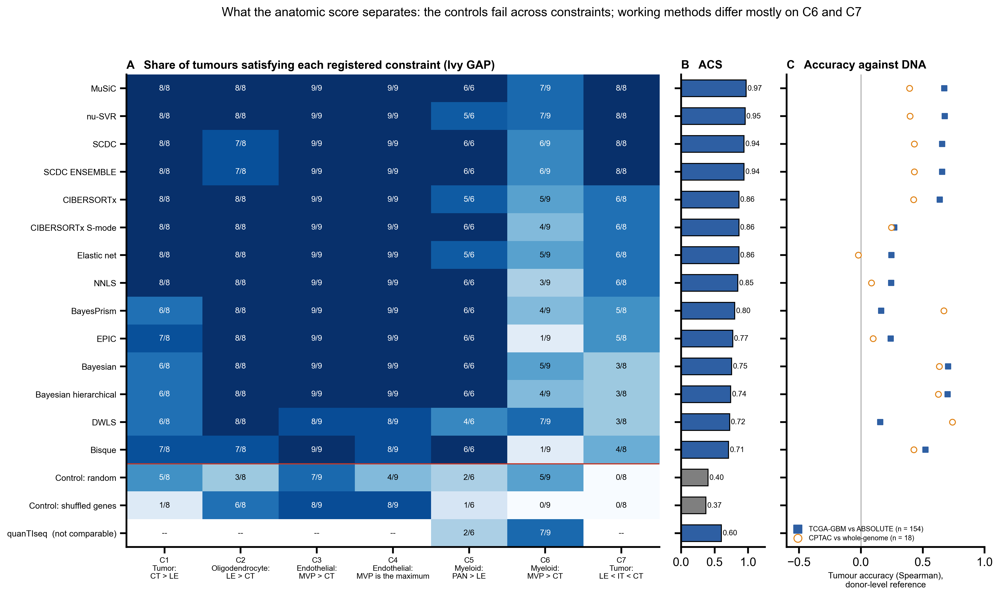

**Figure 16.** *What the anatomic score separates: each registered constraint, method by method.* **(A)** Share of evaluable Ivy GAP tumours in which each method satisfies each of the 7 registered constraints (cells: satisfied / evaluable; darker is a larger share; `results/anatomic/acs_per_constraint.csv`). Methods are ordered by ACS; the red line separates the 14 comparable real methods from the two deliberately broken controls and from quanTIseq, which models only immune cells and is scored on two constraints. The controls fail across constraints. Among working methods the fraction satisfied spreads by at most 0.33 on C1-C5 and by 0.62-0.67 on C6 (myeloid: microvascular proliferation above cellular tumour) and C7 (the tumour gradient, weighted 2), each evaluable in 8-9 tumours: the score's resolution among working methods. **(B)** ACS, as registered. **(C)** Each method's tumour-content accuracy against DNA, on the donor-level reference the anatomic arm uses: TCGA-GBM against ABSOLUTE (squares, n = 154) and CPTAC against whole-genome purity (circles, n = 18; secondary analysis). Registered implementations: BayesPrism and DWLS appear as this project's reimplementations here; their genuine-package values are in `docs/EVALUATION_MATRIX.md` (`docs/METHOD_REPAIRS.md`). Descriptive; nothing is selected on it.

`docs/figures/Figure_acs_constraints.png` · `docs/figures/Figure_acs_constraints.pdf`

**Provenance:** drawn by `scripts/build_paper_figures.py::fig_acs_constraints` (Python 3.14.5, matplotlib 3.10.9), rendered 2026-10-07, from the artefacts under `results/`. The plotting code was generated with Claude Code (Anthropic); see `~/STS_AI_LOG/AI_CONTRIBUTION_INVENTORY.md`.

